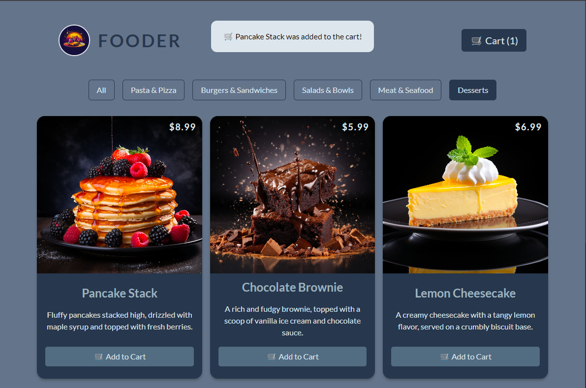

# Fooder: a little Food Order App

This project was completed as part of the [React—The Complete Guide 2024](https://www.udemy.com/share/101Way3@sgJDdX0pSpHHGNxXUiS_alzHsliDEDykD5HPBT6jUiFiX7_DZYL1vVy6sNQ1KpX_Kw==/) Course.

It had specific requisites, stated below but I've added my flare in some parts of the app, to further train some concepts. I've also ignored Maximilian Schwarzmüller (the course teacher) index.css and I've used Tailwind to practice it while building this.

Here's an overview of the main page:

## Goal

The goal of this app is to allow users to see the available meals, store them in a JSON, and send them to the front end using a simple API, add them to their cart, and then check out their order. When an order is submitted, the `orders.json` is also updated.

### Requisites

- Display the Available Meals
- Allow users to add meals to the cart
- Display the cart (on a modal) if the user opens it
- Display the checkout form (on a modal) from the cart

### Technical Details

- Fetch the dummy data from the backend (GET /meals)
- The cart data and user data need to be sent to the backend (POST /orders) for proper validation
- Any error regarding the submission should also be validated
- Loading states should also be considered (getting the meals, submitting the order)

## How to Run

To run this project locally, you need to have Node installed.

On the project root, make sure to run `npm install`, to install the required dependencies. To start the frontend, then run `npm run dev`.

To start the backend, go to `./backend/`, run `npm install` again, and then run `npm start`.

## Extra Features

To practice some React and design concepts, I've added these extra features:

### Available Meals page

- Added a filter mechanism that allows the user to filter by meal category;
- Added a notification every time the user adds something to the cart;
- Changed the price display to be on the top-right corner of the available meal card;
- Changed the "Add to Cart" button to two buttons and a counter, for the user to quickly see how many of those meals were already added to the cart. The buttons allow the user to add or remove, changing the quantity.

### Cart Page

- Changed the design for the user to visually see what's in the cart;
- Added a way for the user to remove every meal with a single click;

## To My Future Self (or anyone else!)

- Organize those Tailwind classes properly, please :P
- Migrate the Cart and User Context to Redux, instead of Context API (I didn't know Redux yet when building this lol).
- Add proper user authentication (something simple), to store the users and the orders in a proper database.
- Experiment with sending emails (but for real), at the end of a successful order.
- Have fun!

## To anyone reading...

Thank you for reading! I've had tons of fun with this project, and I'm loving learning React. I am, by no means, a Pro in this, so feel free to reach out to give some feedback and suggest improvements! Can't wait to create more stuff 👀
